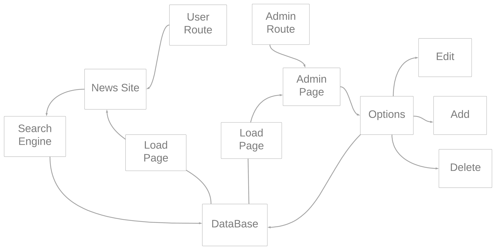

# News-WebSite
📰 This is a News website that show to the user all the news ( dailyNews, weeklyNews and monthlyNews ).
# Description
To check the project working click [here](https://youtu.be/CCGkBecDJK8) i did a video showing the project and explaning!\
This app have two routes , the user one and the admin route. To check it follow the URLS bellow:\
User: [https://augustos-news.herokuapp.com](https://augustos-news.herokuapp.com)\
Admin: [https://augustos-news.herokuapp.com/admin](https://augustos-news.herokuapp.com/admin)

# User
The user experience have the home page that display all the news separately , one coloumn have daily news, other have weekly news and monthly news.\
the user can check one notice clicking in button view, and show a single page with all the data.

# Admin
The admin  area have the login first to  check if you really are the ADMIN after this validation creating a token using JWT you  can access all the sistem,
there you can add a new notice edit and delete , i added a feature to count the clicks each notice had and have a button to manually redirect the notice , lets imagine you have a daily notice,
but you wanna move it to weekly , it's easy just click the button , happen the same with the weekly notice to monthly.\
To test the sistem use the password bellow:

```bash
password: adminadmin
```

# Mental Map




# Dependencies
```bash
  
  $ npm install cloudinary
  
  $ npm install multer

  $ npm install method-override
  
  $ npm install ejs
  
  $ npm install express
  
  $ npm install dotenv
 
  $ npm install mongoose

  $ npm install nodemon

  $ npm install cookie-parser 
  
  $ npm install jsonwebtoken
  
  $ npm install cookie-parser
  
```
# Observations
Before use it don't forget to complete all the .env_example and change it to .env file.\
After this use the command `npm install`, to install all the packages 

